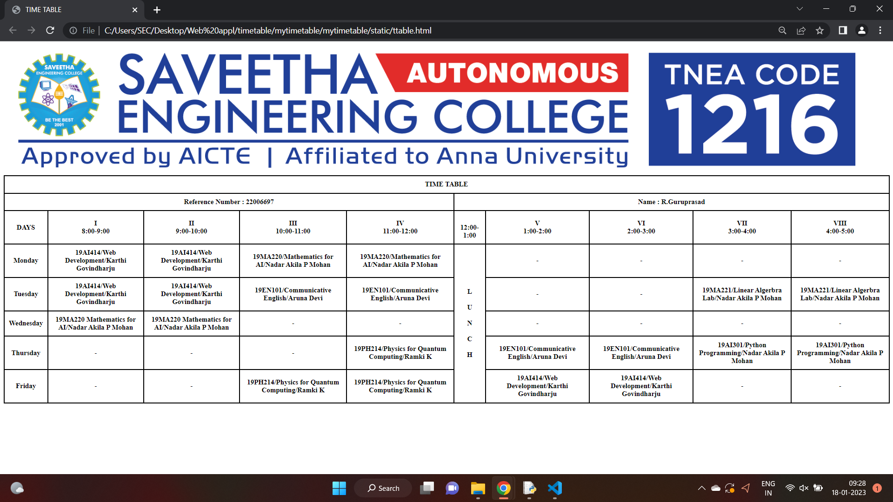

# Experiment_Time_Table

## AIM
To Write a html webpage page to display your timetable.

# ALGORITHM
### STEP 1
create a simple table using table tag
### STEP 2
Add header row using th tag
### STEP 3
Add your timetable
### STEP 4
Execute the program

# CODE
```html
<html>
<head>
<title>TIME TABLE</title>
</head>

<body>
  
   <table border = "1" cellspacing="0" cellpadding="10" bordercolor="black" >
     <tr>
        <th colspan ="10">TIME TABLE</th>
     </tr>
     <tr>
     <th colspan="5"> Reference Number : 22006697 </th><th colspan="5">Name :  R.Guruprasad</th>
     </tr>
     <tr>
        <th>DAYS</th>
        <th>I<br>8:00-9:00</th>
        <th>II<br>9:00-10:00</th>
        <th>III<br>10:00-11:00</th>
        <th>IV<br>11:00-12:00</th>
        <th><br>12:00-1:00</th>
        <th>V<br>1:00-2:00</th>
        <th>VI<br>2:00-3:00</th>
	      <th>VII<br>3:00-4:00</th>
        <th>VIII<br>4:00-5:00</th>
     </tr>
     <tr>
        <th>Monday</th>
        <th>19AI414/Web Development/Karthi Govindharju</th>
        <th>19AI414/Web Development/Karthi Govindharju</th>
        <th>19MA220/Mathematics for AI/Nadar Akila P Mohan</th>
        <th>19MA220/Mathematics for AI/Nadar Akila P Mohan</th>
        <th rowspan="5">L<br><br>U<br><br>N<br><br>C<br><br>H</th>
        <th>-</th>
        <th>-</th>
        <th>-</th>
        <th>-</th>
      </tr>
      <tr>
        <th>Tuesday</th>
        <th>19AI414/Web Development/Karthi Govindharju</th>
        <th>19AI414/Web Development/Karthi Govindharju</th>
        <th>19EN101/Communicative English/Aruna Devi</th>
        <th>19EN101/Communicative English/Aruna Devi</th>
        <th>-</th>
        <th>-</th>
        <th>19MA221/Linear Algerbra Lab/Nadar Akila P Mohan</th>
        <th>19MA221/Linear Algerbra Lab/Nadar Akila P Mohan</th>

      </tr>
      <tr>
        <th>Wednesday</th>
        <th>19MA220 Mathematics for AI/Nadar Akila P Mohan</th>
        <th>19MA220 Mathematics for AI/Nadar Akila P Mohan</th>
        <th>-</th>
        <th>-</th>
        <th>-</th>
        <th>-</th>
        <th>-</th>
        <th>-</th>
      </tr>
      <tr>
        <th>Thursday</th>
        <th>-</th>
        <th>-</th>
        <th>-</th>
        <th>19PH214/Physics for Quantum Computing/Ramki K</th>
        <th>19EN101/Communicative English/Aruna Devi</th>
        <th>19EN101/Communicative English/Aruna Devi</th>
        <th>19AI301/Python Programming/Nadar Akila P Mohan</th>
        <th>19AI301/Python Programming/Nadar Akila P Mohan</th>
      </tr>
      <tr>
        <th>Friday</th>
        <th>-</th>
        <th>-</th>
        <th>19PH214/Physics for Quantum Computing/Ramki K</th>
        <th>19PH214/Physics for Quantum Computing/Ramki K</th>
        <th>19AI414/Web Development/Karthi Govindharju</th>
        <th>19AI414/Web Development/Karthi Govindharju</th>
        <th>-</th>
        <th>-</th>
       </tr>
</body>
</html>
```
# OUTPUT

# RESULT
The program is executed succesfully.

